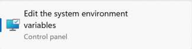

# Image compression and why it matters

## Why bother?
Storage is cheap, data is fast, sites have low traffic so why do we even care about this?  Well there are a couple reasons why I think it is still valid to expect people to have some discipline here.  I won't bore you with my tales of growing up with dialup or no internet at all but that really wasn't very long ago.  I think the story here is multi-faceted.  First it is a good intro to the concept of resolution which is really vital when working with microcontrollers.  Say you want to do a fancy computer vision project but you're running on a rather limited microcontroller.  If you spend money on a super awesome camera in order to resolve the smallest feature size possible you'll find that your vision algorithms are going to run at rates far lower than is acceptable because you can't handle that amount of information at once so too much data can in fact be a problem in some cases.  To get back to concrete examples here this directly impacts the load time of your page and with uncompressed images can become a bit of a drag, and given the nature of how our repos are setup you're all maintaining a local copy of everything that each student in your section commits.  For those of you trying to stretch out that 256GB harddrive to do everything you need it to there is a big difference between a .raw image shot from a fancy iphone taking up nearly 100MB is undeniably beautiful but if you do that frequently that has a very measurable impact on your friends.  Additionally git maintains a complete version history so getting rid of things completely is intentionally difficult which means it is much easier to do things correctly from the start.  Finally the default image size is often much larger than the screen of the device you are viewing it with so a resize will make it fit into your page a little bit better. Finally we should recognize that small deltas across O(100) students make big differences.  You're probably familiar with the concept of compound interest (if not tldr you have have an online bank with a high interest saving account) or have seen the motivational poster with 1.01^365=37.8.  Here the analog is that the final size of our combined repos can vary drastically based on what folks do over the semester.

## How?
I run windows machines so that is what this tutorial will focus around.  The same should work on other OS with the exception of the .bat file but at this point MacOS has built in a pretty useful file compression tool directly in the menu so this is perhaps less necessary for you unless you want to batch process them.

First download ImageMagick from [here](https://imagemagick.org/script/download.php#windows)
To match some of Neil's tutorials make sure to click "install legacy utilities" as you go through the install process.
Make a note of the install location as we will likely want to add it to our path later.

Now there are a couple ways to convert and compress your files.  First it is important to understand what we are trying to do and why.  The tldr is PNG is a pretty format that is kinda bloated and far higher quality than you really need on a webpage.  In order to be nice to both our server and the visitors to your site we'll convert it to a jpeg and do a little compression which will speed up load times, reduce file sizes, and not really impact your file quality.  Neil is a stickler for this as small deltas times ~100 students have big repurcussions.
If you installed the legacy commands his scripts [here](https://academy.cba.mit.edu/classes/computer_design/image.html) are super helpful 
If those fail it is probably because you forgot to hit that checkbox while installing but don't worry as there is a perhaps even cooler way to handle this upcoming.  
First the new commands for those of you that want individual control:  
```magick input.png output.jpg```    Would convert a given file from png to jpg.  
sticking a resize flag in there will change the physical size of the image (many of your phones take images that default to far larger than your laptop screen)  Resize can take either percentages or XX*YY pixel sizes  
```magick input.png -resize 50% output.jpg ```  
finally the quality tag is used to specify the amount of compression to apply to your image.  
A full command might look like:  
```magick input.png -resize 50% -quality 50% output.jpg```   


In my quick testing this brought an image from 500KB to 22KB without much issue.

to verify this works we can inspect the sizes of all the files in a directory by using ls -la if you're in a unix friendly command shell.  The output is in bytes.
Now it is important that we don't throw away our efforts by accidentally committing both the compressed and uncompressed files in our repo.  Something like git add * is dangerous here because it will do exactly what you tell it to which is add everything.  There are many workarounds, only add specific files, move uncompressed images to another directory, update your git ignore, I'll leave that up to the discretion of the reader.  My 2 cents is to not delete the original image in case you learn that something in the process broke, you compressed a bit too much, or some other issue popped up.  You may however decide that I am a digital hoarder and you see no need for the original file anymore.  To each their own.

Now with a little extra magic (no k) and .bat files we can make a quick script that runs through a folder, converts and compresses every png, and is callable from anywhere in our system.  For some this may sound daunting but let me remind you that I am technically a mechanical engieer and I figured this out so you certainly can too!
So .bat files are just scripts that we can bundle and call and if we add them to our default path we can do this from anywhere in our system.  A little extra trick is that you can actually call a script right from your file explorer without even opening a terminal!  Kinda nifty.
For me the script looks like:  
```
@ECHO OFF

FOR %%a in (*.png) DO magick %%a -quality 50%% -resize 50%% %%~na_small.jpg
```

and I saved this as compressAll.bat because I thought the name was appropriate.  You could make some tweaks here if you say normally saved images in another format or wanted to play with compression rates ec.  This is a template for you to have fun with as well as a useful tool.  In a perfect world I kinda want 2 or 3 of these scripts.  One to handle images from my phone which may be another format and likely want more compression, one to handle screenshots that I took locally which need less compression, and a third for outliers.
It is a little annoying with the escaping % characters but what this does is parse the folder, find all png files, resize, compress, and convert them to jpg files and append _small to their file names.  The file name suffix is perhaps not mandatory if your're changing image extensions but I find it a useful convention.  

Now let's make this script callable from anywhere by adding it to your path which is essentially the list of places your computer will look if you try to call a file or command that isn't located where your terminal currently is.  You can kinda think of this as the difference between local and global variables in most languages.
First lets make a permanent home for this script that is easy to access and has room to make more changes in the future.  I just made a folder in Documents called Scripts.  Short, simple, easy to remember.  The path to this folder is then C:\Users\Anthony\Documents\Scripts.  Some of y'all use things like onedrive or have other kinda funky installs so an easy way to see the file path in the file explorer is to just click in the bar at the top and copy it from there.  Make sure to copy compressAll.bat into this folder.  Now we need to update your path to include this location.
The route to get here is a little convoluted but it isn't too bad.  First open the windows search bar and type path.  The top option should be "edit the system enviornment variables"   
  
Open that and click the "enviornment variables" button in the bottom right.   
  
The second element in the top list should be PATH.  Click that and then click edit 
  
Now a new window will open.  Hit new and paste the folder path into the cell then save and close everything.  
  
Now if you have any terminal instances open you should close them in order for the changes to take effect.

## Bonus
Finally a little bonus on using .gitignore:  
Sometimes I like being lazy.  I don't want to deal with remembering what not to git add and just use that nice wildcard to get everything.  That would be a bit of an issue here because my uncompressed images still exist and it would defeat the whole point of this endeavor to compress and convert them if they ended up in the repo anyway.  To fix this we'll leverage the .gitignore file.  This is really designed to not track files with your credentials or API keys etc (which are embarassingly easy to find across public git repos these days)  
tldr to use this go to the top level of your repo and make a file called .gitignore  
Inside that file I am simply going to put *.png and then save it.  That way whenever you add anything in git it will overlook anything that ends in .png entirely and save you from accidentally tracking a file that you shouldn't. 

