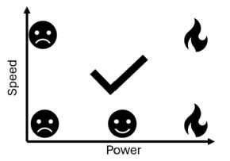
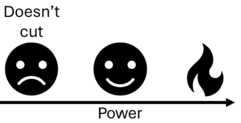
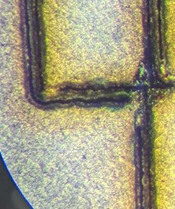

# Laser cutting

## Safety
Fire is wonderful and we wouldn't be where we are today had we not learned to harness it long ago however fire in our shops is something that we should do our best to minimize.  Aditionally there are lots of harmful vapors that can be released as combustion byproducts sowe need to be rather strict with what materials are allowed to be cut in our spaces and what ones should never enter the cutter.  When in doubt always chat with your shop staff.  

## Parameter search
Now asking carboard to not light on fight as you blast it with enough energy to vaporize it sounds like a little bit of an oxymoron but there is actually a relatively wide parameter space in which you get good cuts without risking sending your machine up in smoke.  We (or at least I) can't take a mathematical approach to solving for a range of parameters that will cut your material so we must take an empirical one.  Let's start my making sure we live in the "too fast to cut through but won't burn" regime.  One assumprion that we will make to simplify the process is that our speed should be locked at 100% in order to finish the job as quickly as possible.  This will increase our throughput which is very impportant for serial jobs in shops with few machines, and it turns our 2D parameter search into an easier 1D search.  This is an assumption that will hold true for cardboard and even most acrylic on our lasers but it does start to fail on thicker, denser materials that take more time to cut.  Say you only cared about 5% tolerance then optimizing a 2D search would require ~400 tests and comparisons to ~20 for a 1D search so even an imperfect assumption saves us a lot of effort.  In other words we want to simplify this  
 
  
to this  

  
Now I won't give you numbers because that defeats the point of the exercise but we probably want to start around say 2% power and 100% speed and increase your power a couple percent at a time.  This will feel a little disappointing at first as you won't cut through all the way but it won't be a ball of fire... Don't forget to make note of the nice engraving parameter space that you'll likely pass through as you iterate to cutting.  It sounds funky but you can in fact engrave some pretty decent detail into cardboard.

## Cardboard
Do remember that while kinda nice this is still cardboard.  Load bearing structures are certainly possible but they take quite a bit of thought and finesse.  Joint types might be a little more limiting but nice pressfits are possible.  It is also quite anisotropic with different stiffnessess based on your loading direction and the orientation of the corrugations between the layers.

## Feature size
There isn't a hard rule here but do remember the corrugated nature of cardboard.  If you decrease your feature size beneath the corrugation pitch there is no guarantee that your top and bottom layers are actually connected together.  Additionally very small features become a fire hazard so you might need to adjust your speed/power settings in order to safely cut intricate details.

## Kerf
Kerf is an important feature in many subtractive machining operations which boils down to the width of material removed by your tool.  In this case our tool is a beam of light so it is small but it isn't infinitesimal and if you don't account for it then your parts won't fit together as well as they should.  The easiest way to measure the kerf is to cut an object of a known size and measure what the actual output is.  Say I wanted a 1cm square and got a .95cm square then I would know my kerf is 5mm and if I offset my perimeters by +/- 2.5mm then my parts should come out the exact size that I want them.  Why isn't this built in to the machine in 2024 given that the process is so simple? I don't know.  There is some variance between whether you are keeping the positive or the negative and kerf can be a function of material thickness but getting at least close is pretty easy.  I bet it would be a fun internship at Epilog though.

## Parametric
What does this mean and why is it important again?  Say hypothetically you need to make a box.  You spend a while modelling everything in your cad package of choice and after a couple hours you have the world's best box.  Once you're done you get a call asking if you could change the dimensions of that box a bit to add room for some other component that was forgotten about or you find that your joints were a little loose and you wanted to tighten them all up.  In the best case scenario you have to figure out which sketches set the relevant parameters, find them in your timeline and make the edits then cross your fingers that everything rebuilds properly and you don't end up with missing references, tabs/slots that don't line up, and a pile of spaghetti the untangling of which can take as much time as starting from scratch.  Well most cad tools these days arealso somewhat decent programming environments.  When inputting a dimension instead of doing 1 cm you can do something like ```overall_width = 1 in``` This might feel a bit clunky at first but I assure you it becomes very powerful.  You can also do lots of math in the same panel.  Something like ```(overall_width/num_connections)+kerf-tolerance``` is perfectly valid as long as you have all of these terms defined.  Done properly lots of relative dimensions will let you make very flexible models that can build and rebuild in vastly different sizes and configurations without any issues.  In order to access the list of these parameters from the whole model at once you can use the modify->change parameters button.  Working this way has a little bit of a learning curve but the benefit far outweighs the input effort for all but the simplest of models.


## Fits
How things fit together is a very well studied field with ample resources available to make sure that stationary things stay stationary and sliding things slide.  This however tends to be done in more homogenous materials that are a little more predictable than cardboard but starting from numbers that work in other materials is certainly better than guessing.  I usually use bolt hole charts as a rule of thumb and then adjust as needed if I find my fits are a little loose.  This really should be done on the small scale as a group project which will then feed forward into your designs.  A bit of effort up front will save you from hours of cutting out big complex parts to realize that they're all trash and you need to start again.  I try not to meddle in the process of an individual but some light steering here to avoid big sinks of wasted effort is an exception that I'll happily make.


## Joints

## Bendy bits
Perhaps the most fun part of this assignment is thinking through and making exceptionally flexible parts starting from a rigid material.  This is another well studied field (google flexure design) but given the low stakes here you can abandon the mathematical approach and take a more artistic approach to engineering if you so choose.  The guiding factors somewhat simplify down to minimizing strain which is defined as the change in length of a beam over its original length.  essentially if we can spread the same bend over long windy pieces rather than short stubby ones we will get a more flexible material and fewer kinked sheets.  The specific choice of pattern and the dimensions of it are important factors in determining how a piece is going to bend that I'll come back with more detail on in a future iteraton of this page.  

## Actually using the machine
Machine trainings should always be done in person but here I'll list some important bits that either tend to be forgotten or are simply worth saying twice.

## Going too fast
There are 2 main cases where you won't want to run your laser cutter at 100% speed.  The first is simply once you've maxed the speed and the power and your material is still not being cut in one pass.  Then you simply reduce the speed in order to spend more time dumping energy into the same spot on the material hopefully burning/ablating it away and managing to make it all the way through your material in one go.  The next case however is more interesting.  If you are doing very finely detailed work you might find that the control loop around your machine has some ringing in it which causes noticable deteoriations in performance.  Below I've included some preliminary testing that I was doing on cutting circuits with a cheap fiber laser.  Those are supposed to be straight line segments but you can see the obvious ringing as the machine shakes around.  In this case reducing the speed could be necessary if you really want to push the boundaries of what is possible.  Here it was taking multiple passes to cut through and the lack of proper tracking in the corners caused them to simply not heat the copper enough to cut through.  

  

## Cutting twice
Another edge case worth being cognizant of is simply sometimes you need to cut twice.  If you haven't disturbed your material nothing is stopping you from just running the same job again if you determine that your first attempt didn't cut all the way through.  These are imperfect machines cutting imperfect stock and sometimes you just gotta go again.  Warped stock changes the where the focal plane sits in your material which changes the spot size and the energy density which could cause it to not complete the cut.  Natural materials can have knotty or extra dense areas that change the physical properties, the laser cartridge can get a little toasty and derate its power to help compensate etc etc.  

## Some inspiration
I hate whitespace.  I much prefer bounded problems and a bit of rails in order to help get the creative juices flowing.  The real inspiration for this site was to begin documenting a series of demos that like-minded folks could play with before they get started on their assignment for the week to help seed cool ideas and the "but what if..." thought process.  Everything up to this point has mostly been an afterthought that I figured I might as well document while on the journey to this destination as I thought it could come in handy.  This is one of the weeks in which the need for this isn't particularly strong so perhaps I'll just use it as a deeper dive into flexible bits and pattern choices.