# Milling PCBs with the Makera Z1! 

---

Traditionally PCBs are etched.  You start with a composite sheet with copper on one or both sides of it.  Deposit a layer of photo resist which is optically cured above the copper that you want to keep, then immerse the whole board in a vat of acid that etches away the copper that you do not want to keep.  This process is rather hazardous and very water intensive so for quick turn options on campus we choose another method.

Small CNC mills are quickly gaining popularity and while there are many options this guide will focus on the Makera Z1.  This machine is technically capable of milling many/most materials that you would on a larger machine but this particular guide will keep things simple and exclusively focus on a PCB related workflow.  This process is subject to change as our tools improve.

## File conversions
This step has a bit of friction as we need to go from our finished PCB to gcode to run the machine.  The currently available tools don't support this in one step so we will have a short series of tasks in order to make this happen.  
1. Export your PCB into gerbers  
2. Turn the gerbers into an image  
3. Use mods to convert that image into g code for our machine  
4. Setup the machine and start milling!  

## Export your PCB
## wip should add secion in kicad and fusion about design rules for trace (10 mil) spacing (16 mil) and running drc 
Gerbers are the typical files that you would give to a board house in order to get your design manufactured.  Because this is so commonly used any PCB creation tool should be able to export designs easily.  Before continuing do ensure that all your polygons are poured and your file is saved.  Unsaved changes will not make it into the resulting gerber files.  This is the source of much frustration.  
  
In Kicad with the PCB design open we're going to head to the top left corner and hit file/Fabrication Outputs/Gerbers  
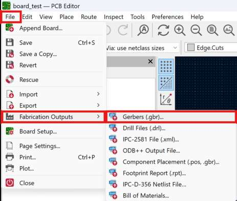  
In the resulting window we are first going to generate our drill files with the button in the lower right.  
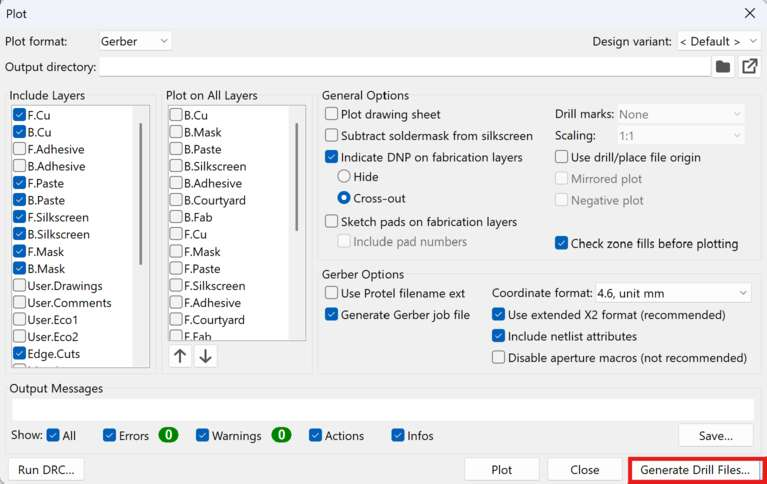  
We'll want to hit the PTH and NPTH in single file checkbox and ensure that our units are in millimeters then click generate in the lower right corner.   
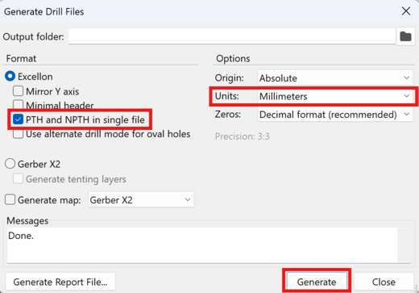  
Now we can close that out and go back to the main Gerber window.  The defaults here will generate some files that we don't need but it isn't a big deal so we can just keep all the defaults and hit the plot button at the bottom of the window.  
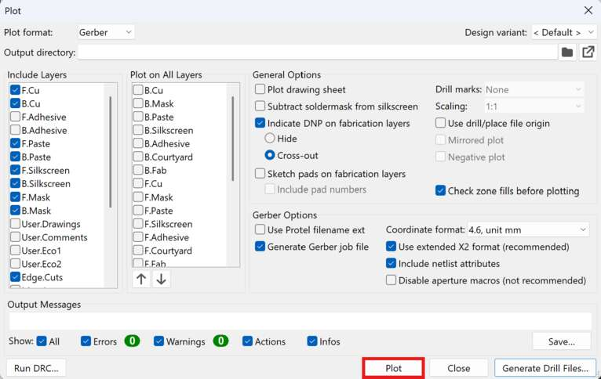  
The resulting files will end up in whatever location you have your PCB saves.  If you're unsure you can expand the section that says "Output Messages" and see the file path listed there.  

  
Fusion will have a very similar process:  First again remember to save your most recent file.  In the top toolbar hit the manufacturing tab then this button with the crazy long name.  
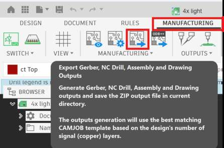  
This will auto export a zip file of all the default gerber files which will contain everything we need.  Crucially this is a .zip file which is usually what a normal PCB vendor would want but you'll need to extract it before grabbing the contents for our tools.  The file path is also kinda ridiculous.  Most of the files you need will end up in the CAMOutputs/Gerbers subfolder but if you have any holes in your board then you will also need the file in the CAMOutputs/DrillFiles subfolder.  To keep things easy later go ahead and grab the drill file and drag it into the Gerbers folder with the rest of the files.

## Convert gerbers into images
Now that we have gerber files ready we'll want to convert them into PNGs.  In order to make this easy we're going to use Quentin's sweet [Gerber2Img converter.](https://quentinbolsee.pages.cba.mit.edu/gerber2img/)  As the gerber files are different dimensions the order of operations here is important!  Failure to follow these steps will cause your traces/outline/holes to be misaligned.  

First we will grab both the board outline and the holes files.  
In Kicad the board outline file will have -Edge_Cuts.gbr as the end of the file name and the holes file will have the .drl file extension.  Select both of those files together and drag them into the the window on Quentin's tool.  

In Fusion the board outline file is in the CAMOutputs/Gerbers folder and called profile.gbr and the drill file is called drill_1_16_xln. Select both of those files together, which is why we moved the drill file into the same folder earlier, and drag them into the the window on Quentin's tool.  

Check the Black and white checkbox and ensure you lock both the origin and Dimensions after loading these files.  Then press Download render in the bottom left.  I suggest naming this file after your design and noting that it is the outline.  Something like test_outline.png but really it is up to you.  
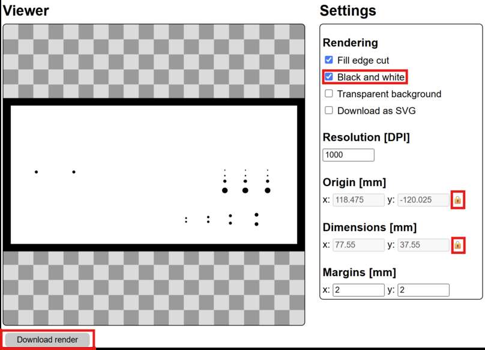  

Now without refreshing the page we'll take the top copper layer which has all your traces and pads and make an image for that too.  In KiCad that file will have the suffix -F_Cu while in Fusion that file will just be called copper_top.gbr.  Moving that file in should give you a window that looks something like this:
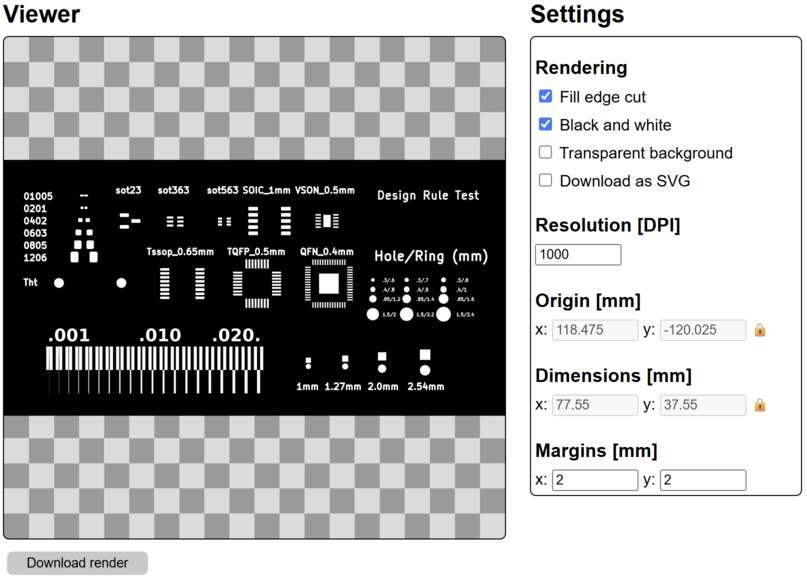  
Go ahead and download this file as well and name it something like test_traces.png so you remember which one is which.  If your board is double sided then repeat this process with the -B_Cu file for KiCad or the copper_bottom.gbr for Fusion.

# Images to G-code
**Note this step must be done in Google Chrome, may other browsers will not work properly**  

Now that we have good files our next task is to turn them into instructions that our machine can understand, in this case those instructions are known as G-code.  This is a very simple language that we won't worry about too much on this page.  In order to generate reliable g-code quickly we'll use a tool called [mods.](https://mods.cba.mit.edu)  In the top left hand corner hit Programs and then either scroll down until you see Makera Z1 and click "mill 2D pcb" or just type Z1 into the search bar to get there faster.  This will open up a kinda funky workflow that looks like this:  
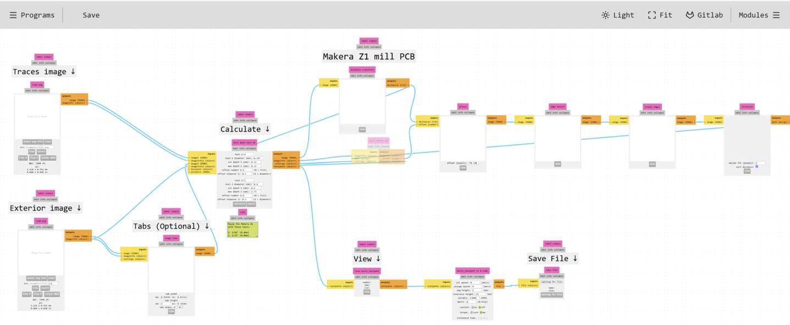  
Thankfully we only need to interface with a few places here in order to get our file out.  First we're going to go ahead and load our traces and outline images on the left hand side.  Hit "select png file" and navigate to where your images are stored.  There are some rotation, flip, and inversion tools available but we shouldn't need any of them for normal single sided boards.  Once loaded those windows should look something like this:  
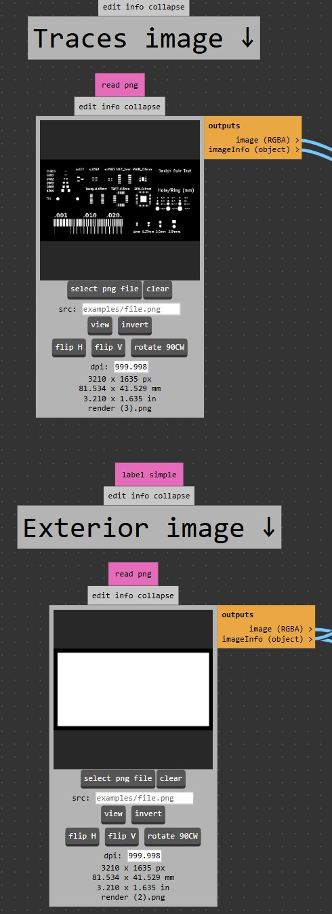  
Now head over to the calculate section.  
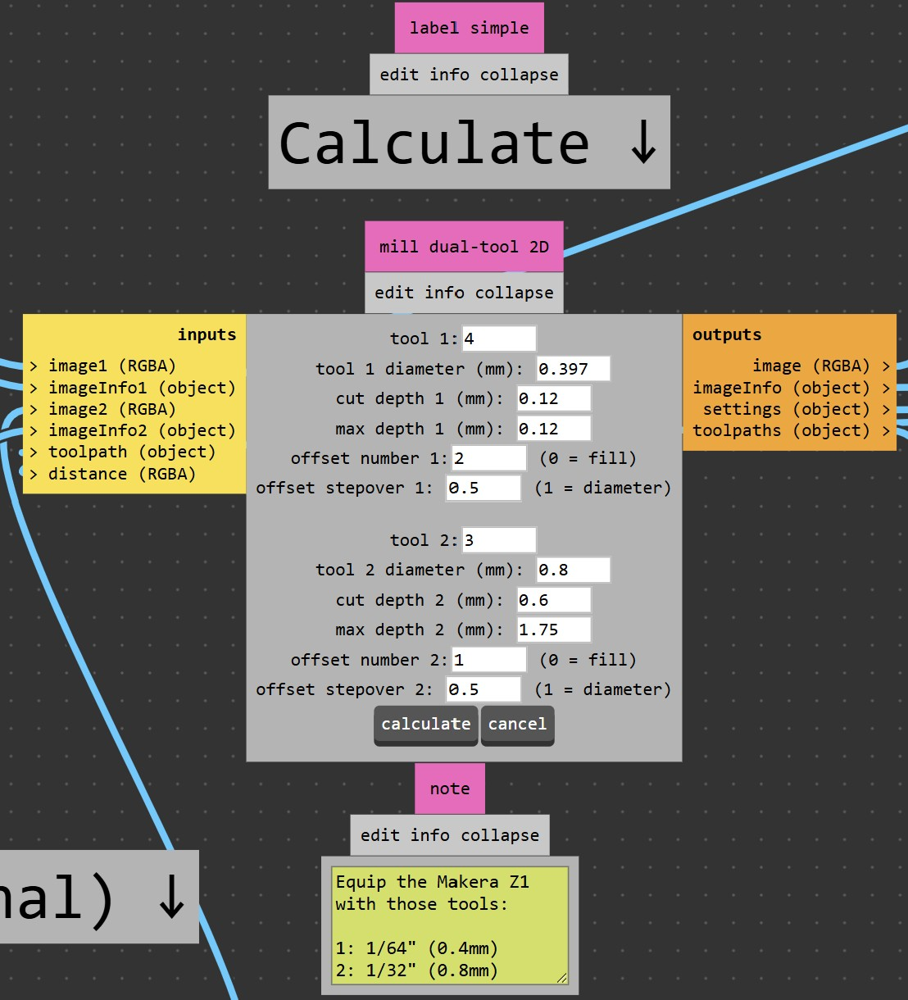  
We should be able to just accept all the defaults here but it is worth touching on them quickly.  Tool number is what the machine is going to call each tool internally.  It doesn't really matter but due to how something is displayed later keeping it at the default 4 and 3 is fine for now.  Tool diameter as the name implies is simply the width of our endmill.  We'll use 1/64" (~0.397mm) for traces and 1/32" (~0.8mm) for cutting the board outline and drilling any holes.  Cut depth is how deep into the material we are trying to go.  In theory we only need to go ~35 microns for typical 1 oz copper but any variations in the thickness or flatness of our stock would make hitting that spec exactly a bad idea.  0.12mm gives us enough room that we can tolerate the bowing that may be present in our stock and still get good results.  For incredibly delicate traces you may occasionally want to decrease this number.  Max depth is how deep the tool is allowed to cut in one pass.  For instance if cut depth was 0.12 and max depth was 0.06 then it would take 2 passes to cut all the way through.  Here doing our traces in a single pass is fine.  Offset number and offset stepover combine to determine how long your baord takes and somewhat how difficult it is to solder.  In this case the first pass of the tool will remove a full diameter (~0.4mm) worth of material and the next will remove an additional 0.5 x tool diameter for a total of ~0.6mm of clearance between the copper you care about and the next closest piece of copper.  If you struggle with soldering you might increase the offset number in order to give yourself some more space.  The defaults for the 1/32" endmill are also acceptable.  The only notable difference here is that since the tool will be used the cut the board out it must make more passes to get to the full depth.  
Now go ahead and hit the calculate button in the bottom of the window.  This will do a bunch of math and eventually settle on some toolpaths.  A new window in your browser should automatically open with a view of the toolpaths.  If it doesn't just hit view in the toolpath module to the lower right.  
  
# Inspection  
Looking closely at the generated toolpath is a crucial step of the process.  
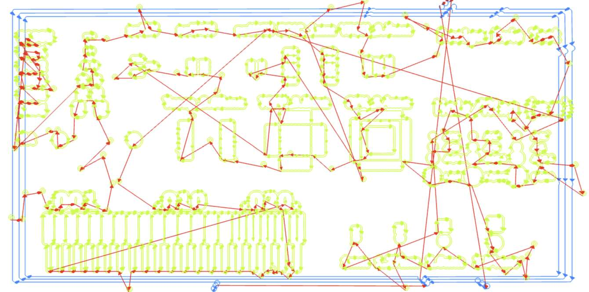
It does look a little crazy at first so lets break it down by color.  The light green lines are cut paths with the smaller endmill.  This is what will create the traces and pads on your PCB.  We should look closely at these to ensure that there are no areas that aren't being isolated.  Let's start with a smaller section of this image, the toolpaths it created, and the actual finished board for context:  
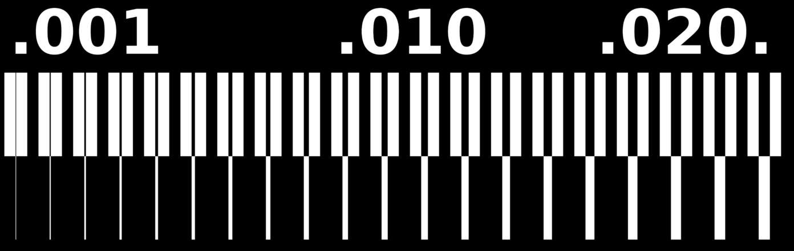 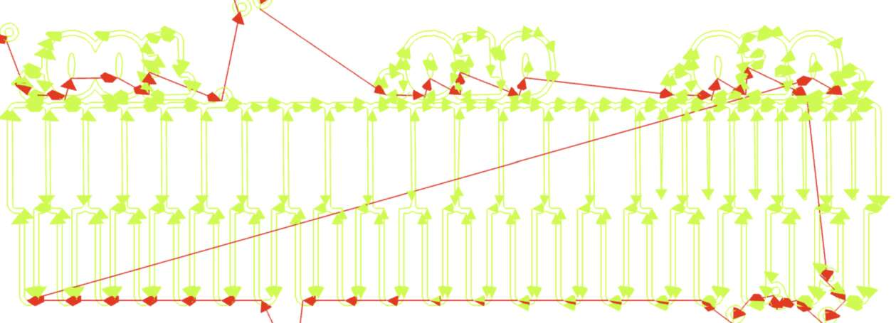 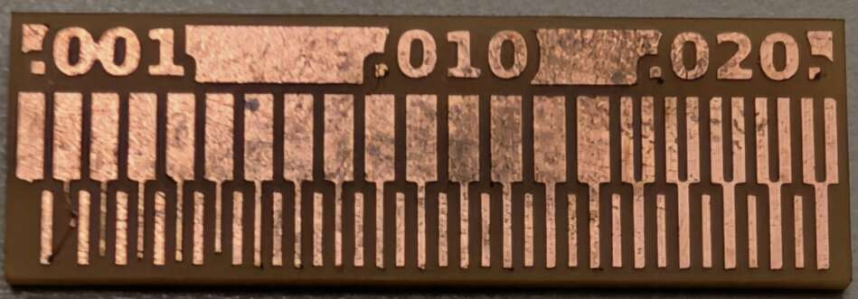  
This image combines 20 repeating units.  The bottom of the unit is a trace that goes from 1-20 mil (remember 1 mil is 0.001 inches not one mm) while the top of the unit is a gap or space that follows the same 1-20 mil increment.  Since our endmill is 1/64" or ~16 mil we should expect it to be able to fit into spaces that are 16 mil or larger and any gap smaller than that should disappear and become fused copper. If we look at the toolpath then we can see that is exactly what happens.  Once the gap is 15 mil or smaller we stop generating toolpaths that would enter it.  This would effectively short the adjacent pieces of copper.  If that is important to you then we would have to go back and edit the file in order to provide a little more clearance.  Alternatively if it is just one troublesome spot then grabbing an exacto and slicing the copper once the board is done milling is a fine solution.  Now what is the smallest trace that survives?  That is a much more nuanced question.  Looking at the board again we can see the 1 mil trace is simply gone.  The 2 mil trace has lifted off the board and will rip off soon.  The 3, 4, and 6 mil traces have all gotten a hair shorter than their original design so they aren't robust options either.  Staying 10 mil or larger is pretty much guaranteed to work across your entire board.  Going smaller than that puts a lot of trust into the glue that is holding down your copper and it is very likely to fail somewhere on your board while will cause some debugging issues down the line.  

# Export G-code
Now assuming any issues have been spotted, addressed and recalculated your last step on this page is to go to the save file module and hit save file.  The size of this file will vary widely based on the size and complexity of your board but if it is something in the 1Kb-1Mb range it is likely correct.  Smaller than that usually denotes a part of the process failed.

# Machine setup (note this software is in beta and the interface may change)
Alright now that we've got good files it is time to actually work with the machine itself!  We'll start by turning on the machine using the red rocker switch on the back of the machine near the power cable.  The machine will take ~30 seconds to home and get ready.  In the meantime we can open "Makera Studio" which is their combination CAM software and machine controller.  First we'll connect to the machine so open the device menu, if the box says no device then click it and choose the Makera Z1 from the list.  
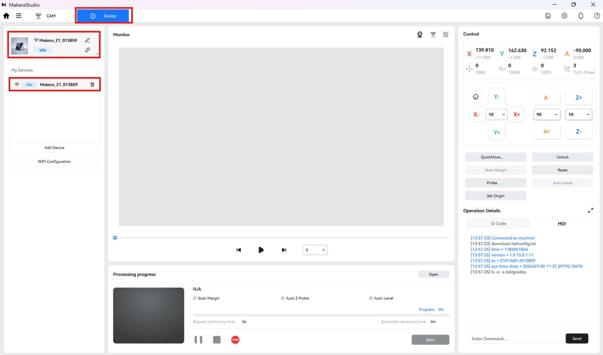  
Once the machine is connected we need to upload the gcode that we generated in mods. Stay in the device menu and hit file storage then upload on the top right of the screen.  If the upload button doesn't do anything then ensure the machine isn't asleep.  Press the button on the front of the machine to wake it up.
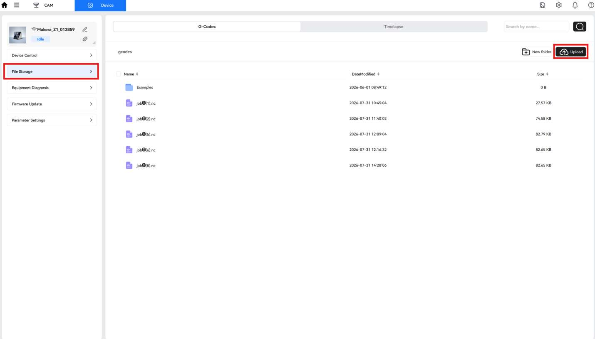  
This will upload the file to the machine's local storage but to actually open the file you'll need to select it and press the check mark.  
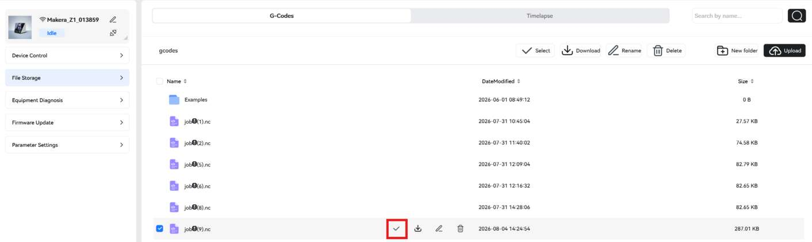  
It will then transition to the device control view which will have a rendering of your job in the top center window, a jog control in the top right, and machine status in the bottom center.  It's a good idea to give the top preview a once over to make sure it looks like what you expect. 
# Mounting PCB stock
To keep things simple we tend to use nice double sided tape for most fixturing.  Flip your stock over, apply 3 nice strips of tape all the way across the board, ensuring they don't overlap eachother or extend beyond the edges of your stock.  
  
Align your stock in the corner bracket and press down firmly to ensure the tape adheres well.  Now go ahead and hit the start button at the bottom center of the makera studio screen.  You will then be borught to a details window that looks like this:  
  
In here it is important that all the check boxes are enabled and we hit config to set our job origin.  
  
I am using Anchor 1 which is hard coded to the 0,0 point on the angle bracket, and applying an additional 10mm offset in the X and Y axes in order to ensure that the endmill does not collide with the bracket.  If your stock has some holes in it you'll need to play around with values to avoid them.  When satisfied confirm the window and press Next in the operational details window.  In the following window you'll want to enable all the options except for the last one.  
  

<!-- Google tag (gtag.js) -->

