# Prusa Slicer Tutorial

***

[Prusa slicer](https://www.prusa3d.com/p/prusaslicer/) is the slicer that we use in order to control the array of Prusa machine thatwe have in the shop.  I find this strikes the best balance between ease of use and full control of complex features.  This tutorial will start with some simple parts and then progress to more advanced features that may become useful to you as you start making mroe specialized things.  A more general overview of 3D printing in general with fewer machine specifics can be found [here](3Dprinting.md)

The slicer itself looks like this:  
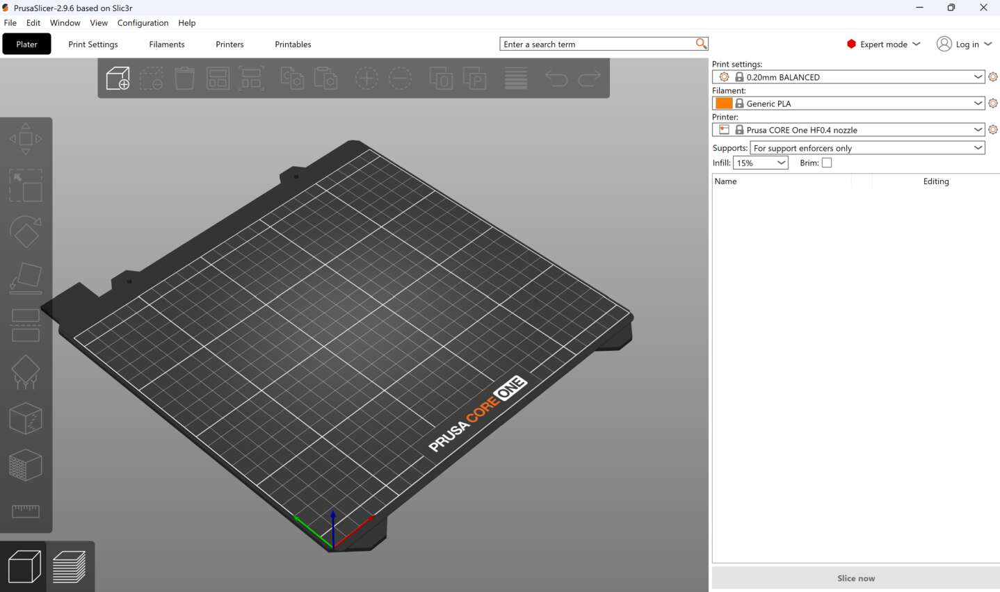
There is kinda a lot going on here so we'll just start with the minium required steps to get a file printed and expand from there.  
## Importing a file
First import your stl or 3mf (or similar format) object using the file/import option in the top left or the hotkey control+i.  The file will generall be imported in whatever orientation you designed it in which may or may not be best suited for this manufacturing method.  In my case I'm printing a little hook that came in like this:  
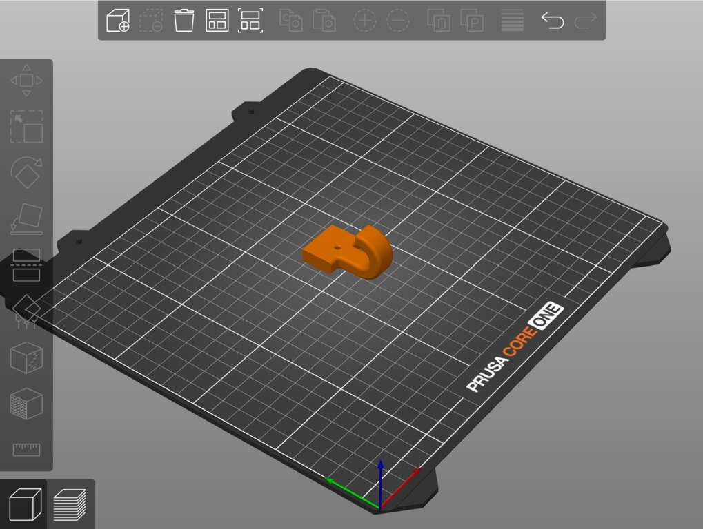  
## Part Orientation  
In order to pick the proper orientation of our part we need to consider how a 3D printer actually functions.  Your part is more or less made layer by layer by squirting out molten plastic from something not that far off from a hot glue gun.  This means that the quality of layer N is incredibly dependent on the contents of the previous N-1 layers.  In this orientation most of the part will be well supported by the material beneath it until we get to the tip of the hook which might get a little dicey.  If we got to the slice preview by clicking the stacked sheets in the lower left corner here:  
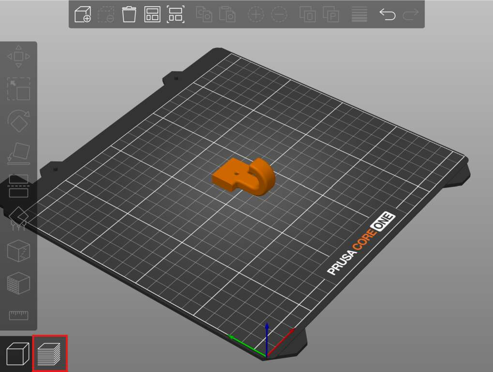  
Then after a few moments depending on how complicated your part is we'll transition to a view that looks like this:  
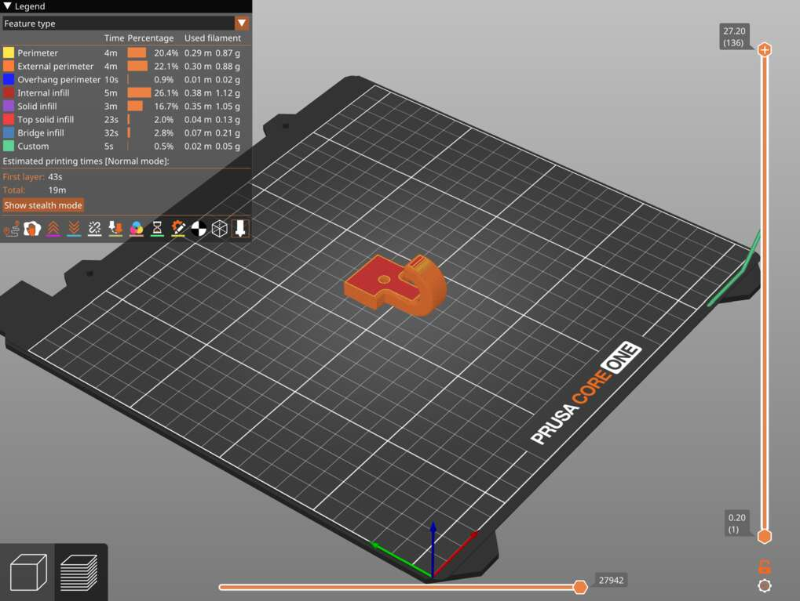  
Here I always do two tasks before proceeding with my job.  First I take the slider on the top right hand side and drag it all the way down to the bottom.  This will allow us to see what the first, and most crucial, layer of our part will look like:
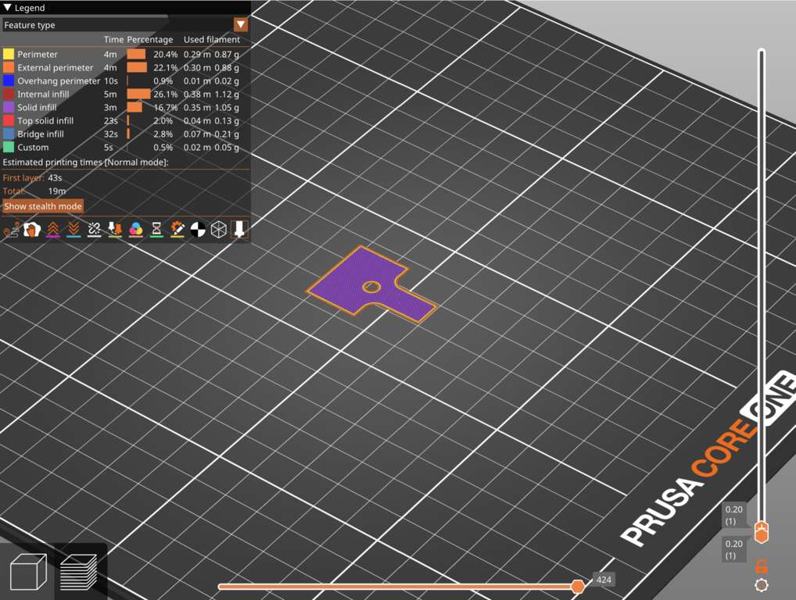  
We care a lot here about the surface area of this layer.  If it is too small then your part will likely break free from the bed while printing causing the job to fail.  Frequently parts will be imported at a slight angle such that a small sliver of your part is touching the bed.  If you see something that looks like this:  
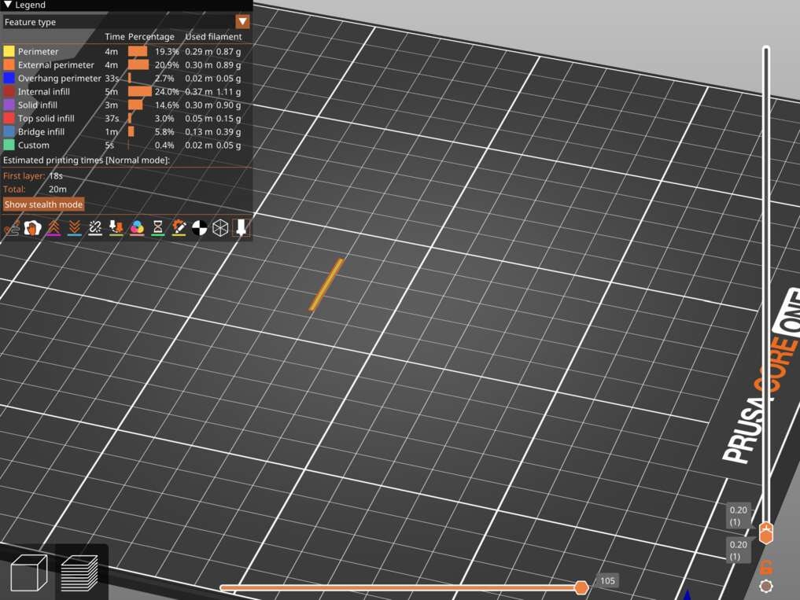  
then your job will almost certainly fail and you will need to adjust the part orientation before continuing.  We can do this adjustment using two tools.  First click the body you are trying to adjust, which should cause it to turn green, then choose either the upper rotate or the lower "place on face" tool.  
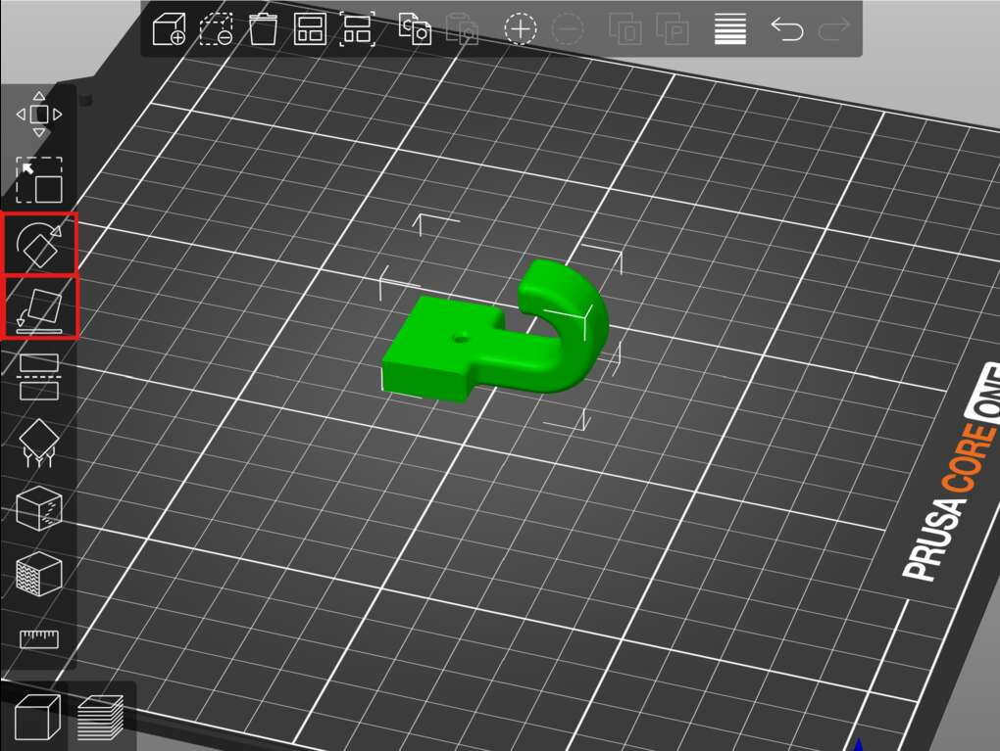  
Generally the place on face tool is much easier and will work well in 99% of situations.  Once selected your part will highlight many white flat shapes.  
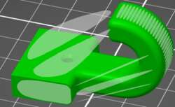  
Clicking one will automatically snap it down to the surface of the bed.  This can be more straightforward than the rotate tool as you won't need to find whether something is at a 36.5 degree angle or something weird like that. Rotating the screen to view the bottom of the part and selecting the large shape there will snap it flat to the bed and ensure we get the best adhesion possible.   
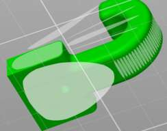  
When printing more advanced parts we may also want to think about filament direction in addition to adhesion but we'll cover that further down the page when it becomes relevant.  
The second thing that I do before advancing form this step is to just scroll through the layers from the bottom up looking for things that seem poorly supported.  Prusa will helpfull color this in a dark blue color.  On this model the tip of the hook is worth looking closely at as the subsequent layers might not have a ton of material under them as they are laid down. Dragging to the appropriate angle and switching to a side view:  
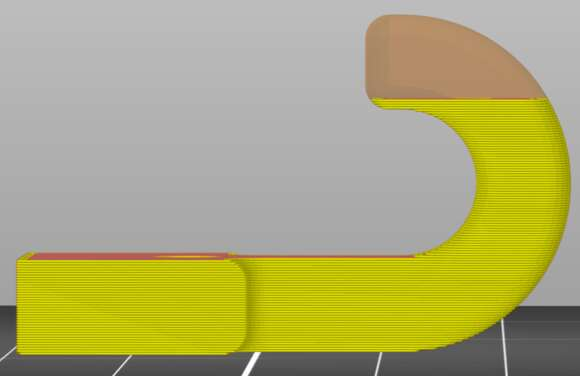  
This actually doesn't look too bad.  There might be a tiny bit of sagging but it isn't on a critical part of the model and might not even be noticable. If we were to make a poor decision and print the hook upside down we would see a bright blue layer and Prusa helpfully calls out a message at the bottom denoting that we might experiece print stability issues as a result of our choice.  
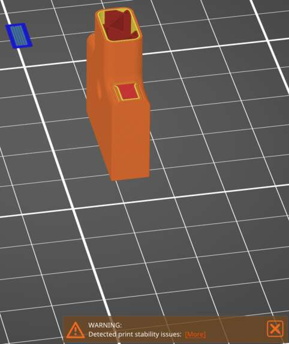  
This print will not survive. Plastic will continue to be extruded over open air and the part will fail unless we add support material which is described further down the page.

## Layer height
In the top right corner of the screen you'll see a box labeled print settings.  This sets how thick each layer of filament is as well as some mechanical properties.  A great default here is 0.2mm BALANCED.  This is small enough that the layer lines won't be super noticeable while also printing quickly.  For a finished prototype you could reduce the layer height to make it "prettier" while for a rough draft that you want done as fast as possible you could consider increasing the layer height.  In general nearly every part is ok to print at 0.2mm.  If you want to get better detail there is an adaptive layer height that will prove more useful than changing it as a gloab variable here.  We will cover that tool further down the page. I note this because the scaling is very linear.  If your part takes 8 hours to print at 0.2mm it will take ~16 hours to print at 0.1mm without playing some tricks to speed it up.  This can get very lengthy and we should strive to treat our lab mates with respect by not hogging a printer for an extended job when it isn't necessary.

## Filament  
The vast majority of jobs in our space will be printed in PLA.  This is a standard filament that is relatively strong, looks pretty good, and prints very quickly.  We also stock PETG which prints more slowly but has some better mechanical properties compared to PLA.  The slower print time usually causes a "prototype in PLA then transition to PETG for final models" approach for items that will be under heavy load or will be used outside in high UV enviornments.  Occasionally we will have TPU stock for flexible components and while a little annoying to get started this usually prints relatively well.

## Supports  
Supports can be enabled here:  
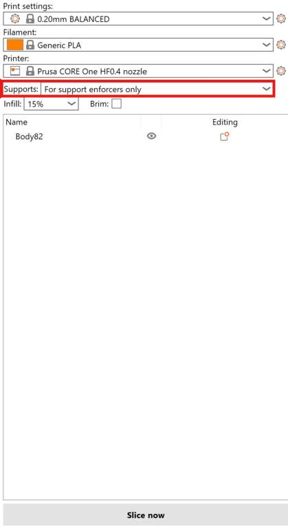  
But they should be avoided whenever possible.  Their job is to add extra plastic to ensure that we don't have unsupported overhangs.  They are useful when printing funky or very organic objects but fundamentally they make your job take longer and their job ends as soon as the print is complete so they become trash.  If we really needed to print the hook upsidedown for some reason supports like this might be enough to get the job to survive.  
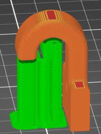  
This causes the job to jump from 19 minutes to 32 minutes which is a very hefty increase that we could avoid simply by changing our part orientation. If you do need supports choosing the option "on build plate only" will prevent supports from being generated on top of your model which will make them easier to remove.  I am also a fan of organic supports.  To enable them head to prints settings/support material/style and set it to organic.  
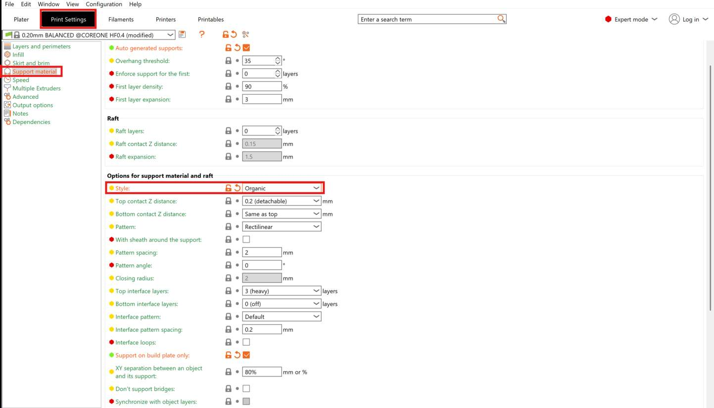    
This will then generate supports that kinda look like an alien tree eating your part.  These tend to be much easier to remove than the traditional snug option.  
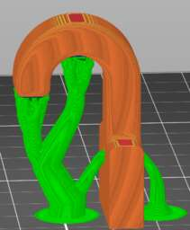  

## Infill
If we switch to a simple part and look at a seciton view we can get a good view of the infill that the slicer is generating for us.  This is 15% infill with the default grid pattern shown in red below.  
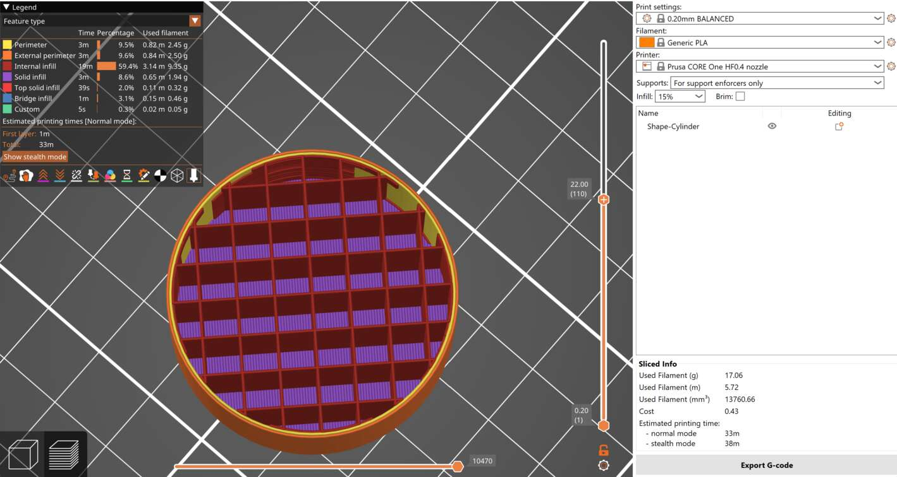  
15% infill tends to be a pretty good balance between strength and print time.  This part prints in 33 minutes and will be relatively strong.  Occasionally you'll need to adjust the percentage in order to fit a specific design goal.  Parts with lower infill will be lighter or more optically transparent if you're trying to shine light through them.  Folks often fall in the trap of "I need my part to be strong, it should be 100% infill!"  This however does not work well.  The long story short is that every material has a Coefficient of Thermal Expansion or CTE.  Adding more mass of plastic in your part that is cooling from over 200 degrees celsius to room temp results in the build up of a lot of internal stress.  As the amount of plastic increases the resulting force also increases and can cause your part to warp up off the printbed ruining your print.  This also can increase your print time pretty dramatically.  Increasing the infill density to 60% and changing nothing else nearly doubles this print time to just over an hour.  If your goal is just a stronger part this next section will discuss a much better approach.  

## Perimeters (how to efficiently add strength where you need it)
Rather than globally increasing the infill percentage going to the print settings/Layers and Perimeters section and changing the number of vertical shells is often a much better choice.  
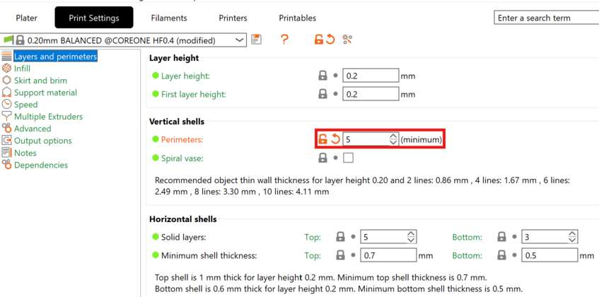  
Increasing this from 2 to 5 will add a ton of strength and rigidity to your part while in this case only increasing print time from 33 to 34 minutes.  
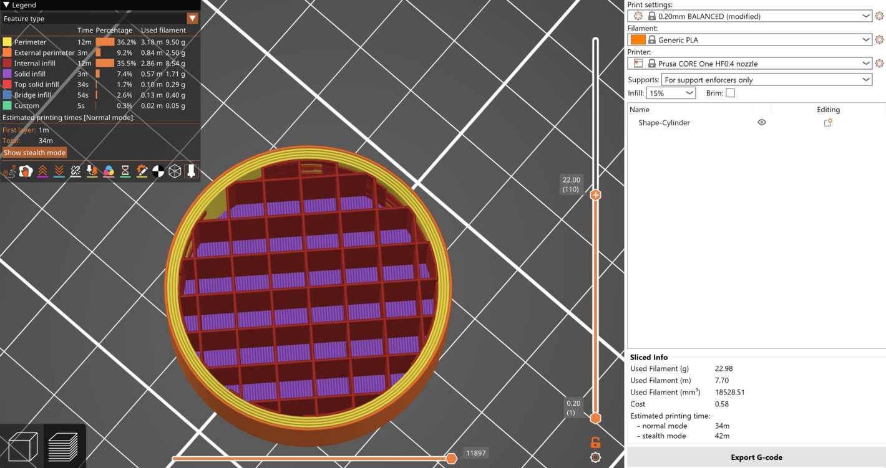  

## Brim
If your part geometry makes bed adhesion a struggle, and you've washed the print bed and it still struggles with adhesion, you may find simply enabling a brim is enough to solve the issue.  This will add a few mm wide strip around your part for the sole purpose of increasing adhesion.  This will be 1 layer tall ensuring that it is easy to remove upon completion of the print simply by peeling it off.  Since this is only a small bit of plastic your print time will only increase by a handfull of seconds.  
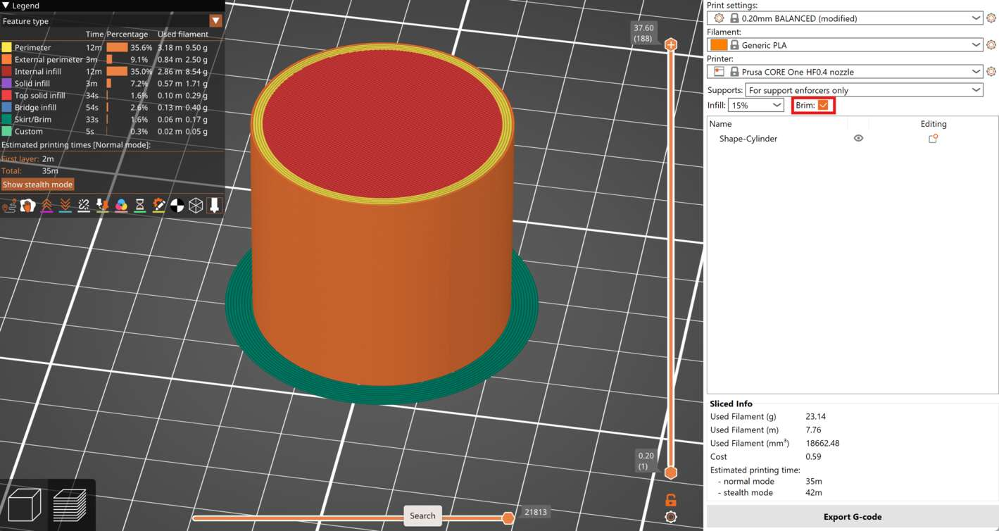

## File Exporting
Once the settings are all happy and you're ready to go hit the Export G-code button in the bottom right of the screen, save the resulting file to a USB drive, and head over to the machine to actually get it printing.  The guide for setting up and using the machine itself is here.

# Advanced settings
Perhaps the best feature of the Prusa slicer is the ability to really get in and modify the behavior of the machine and play with things.  Below are some that you may find particularly useful.

## Paint on supports
Automatic support generation is fine for many jobs but sometimes you'll appreciate an extra level of control.  If you disable automatic generation then select paint on supports on the left hand toolbar.  Left clicking and dragging on your model will mark blue areas that will be enforced with support material while right clicking will ensure that support is not generated at a specific area.  This can help keep support material out of holes or small areas that it would be difficult to remove or simply speed up your print time by not wasting time supporting areas that do not need it.

## Fuzzy skin
Fuzzy skin is the term coined for essentially adding random noise to the surface of your model.  There are two big use cases here, first the resulting organic surface does a good job of hiding layer lines and making some models more aesthetically pleasing.  If I were to print a tree or a log I could spend countless hours modeling a surface texture to make it visually convicing.  Instead I could roughen up the surface with 1 click in the slicer and skip the texturing of my model entirely.  Alternatively this is also a great way of adding grippy texture to a surface for things like climbing holds or tool handles. This can be applied to all external surfaces or painted on in specific areas.  

## Vase mode
Sometimes you want models printed with exactly 1 external wall, no seams, and no infill. This might be because you care about the external surface or because you want a translucent surface that light behaves predictably through.

## Combining infill
If you have a particularly large model that you want to optimize the print time of some low hanging fruit is to look at combining infill layers.  This will have the effect of printing your external perimeters that you can see at your normal layer height while printing the infill much coarser in order to save time.  Depending on your model this could be a negligible savings up to a factor of 2 for large models with lots of infill without sacrificing much.  This setting is available in Print settings/Infill/Automatic infill combination.  
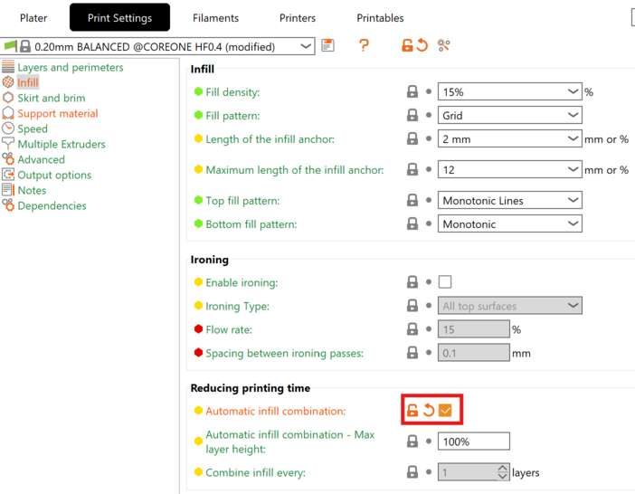  

## Variable layer height
Layer height to level of detail isn't actually as linear as we make it out to be.  Every surface has some stairstep approximation applied to it.  This causes vertical features to look better than a curved top surface such as a sphere.  Reducing the layer height as the surface of the sphere becomes closer to horizontal can cause your models to come out much cleaner.  Since this tends to be the last bit of your job the time spent cleaning this surface up is often negligible.  Let's look at this simple sphere:  
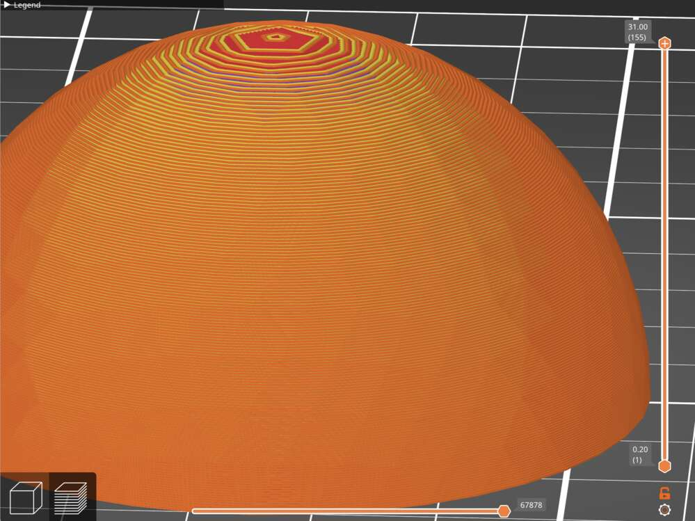  
If we zoom in at the lower layers we can see that each layer of filament is almost vertically stacked on the last layer which will result in low surface roughness and look great.
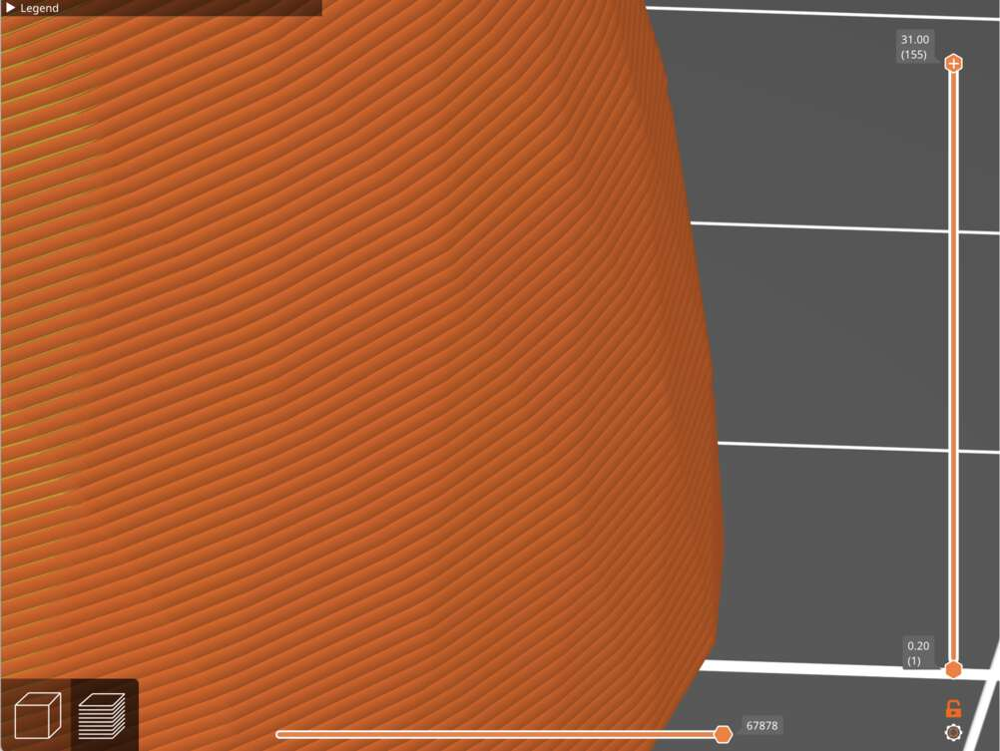  
This however isn't true if we look at the top layers.  Fundamentally the stairs end up covering a large amount of the XY coordinate for each Z step so things look very rough.
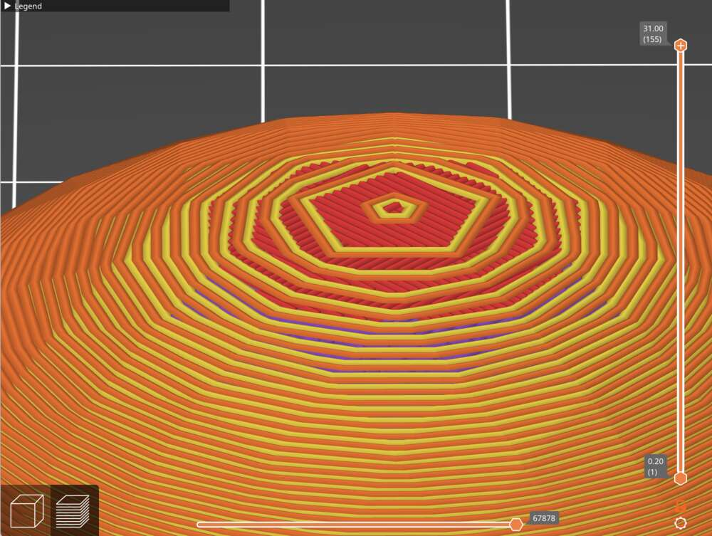  
In order to fix this we would have to reduce the layer height but doing this globally would greatly increase our print time while not having a very large impact on the print time.  Variable layer height allows us to take a more nuanced approach adding detail where we need it while allowing less important areas to stay rough. This is available in the top toolbar.
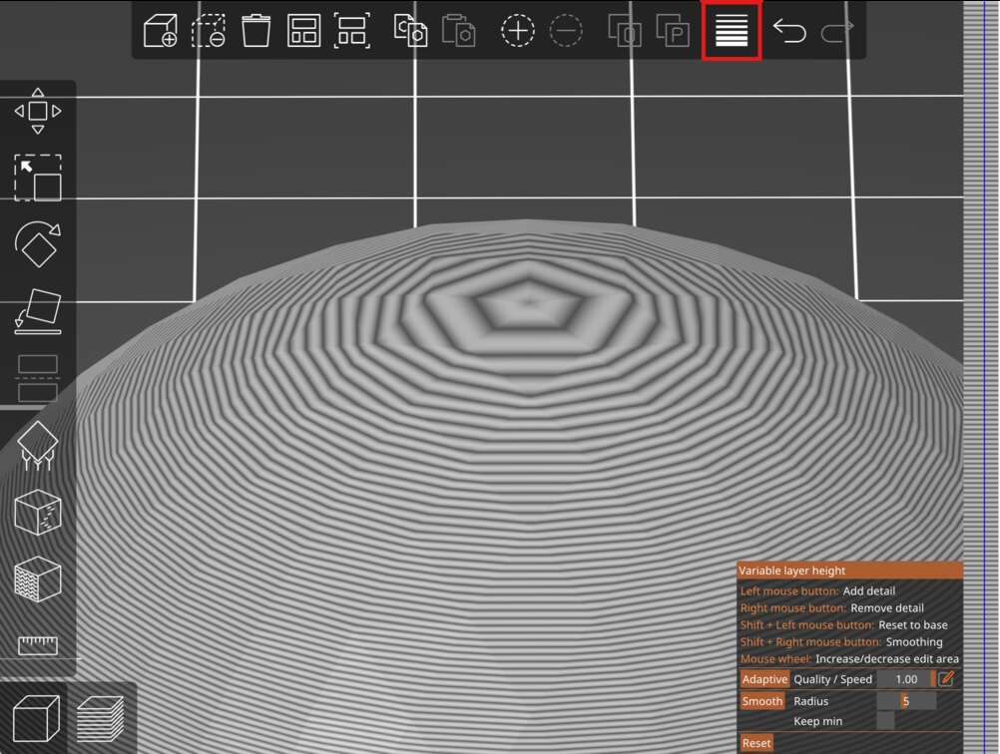  
Using the tool is a little funky.  Hover over the vertical bar on the right of the screen and at the layers that need extra detail hold left click until the feature looks more like how you want it.
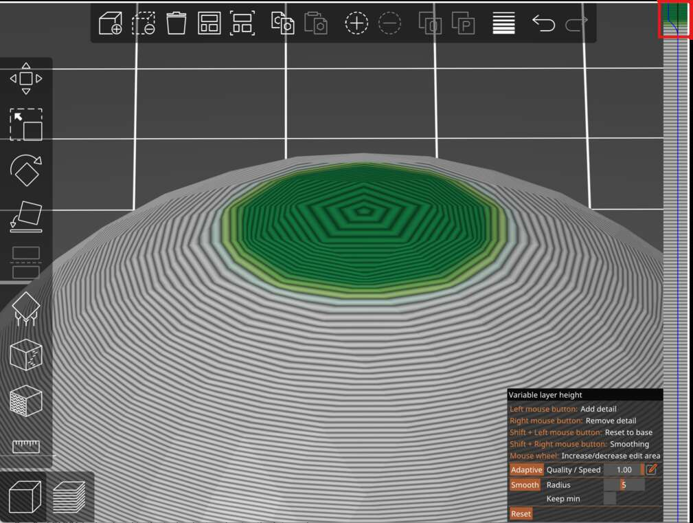  
This ends up smoothing out the top surface so it doesn't look as rough and clearly 3D printed as it did before while only increasing print time by a few seconds.  
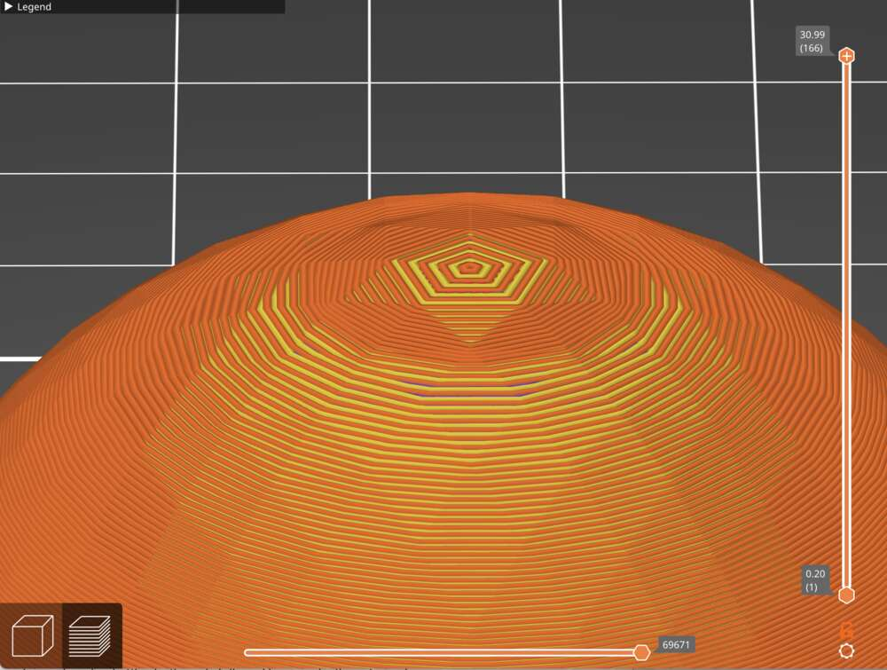  

## Cutting models
Sometimes you have a model that needs to be cut along a plane.  This could be because your print is simply too large for the machine, maybe you have a 3D scan with some random junk in the model, or you simply need to make some adjustment to a model without opening blender or a CAD tool.  This cut tool will also allow you to place connectors such as pegs and holes in order to make the later reassembly of the models easier and more precise.

## Exporting the file
Once you slice the model you'll see a button in the bottom right that says "Export G-code."  Click that and save it to a USB drive.  There is a collection of USB drives on the top shelf of the rack of Prusas or just generally through the lab.  The drive needs to remain plugged into the machine for the duration of the job so it is best to not use your personal drives.  Do try to keep the default file name.  It helps us restart the job in case it fails for some reason.

## Actually running the machine
Counter intuitively we're going to first mention removing a finished print from the bed as you'll often need to do this before you can start your job.  The print bed is a simple steel sheet held down magnetically so if you grab the front you can just lift up.  If a just finished be careful as the plate can be 65 celsius which is pretty toasty.  The sheet itself is rather flexible so for rigid parts if you just bend it a bit that's usually enough to break your part free. If it isn't quite off just grab it and apply some torque and your part should pop off.  If not feel free to use the plastic scrapers hanging next to the machines.  Flexible filaments will generally take more elbow grease to remove than rigid options.  Do also remember to peel off the small line at the front of the bed from the nozzle cleaning itself.  It's also good practice to avoid touching the print surface as much as possible.  Every time you touch it a little bit of oil from the surface of your skin is left on the build plate.  This builds up over time and is roughly the #1 cause of failed prints. Simple soap and water is enough to wash the bed and restore it to a functional state again.  Once the bed is clear load it back into the machine ensuring that it is straight, flat, and all the way to the back.  There are 2 angled faces in the back that should line up on 2 bolts so you'll feel when it's in the right spot.  

Alright now that the bed is clear go ahead and plug in the USB drive to the front screen.  While that loads we'll check the filament to ensure the plastic type and color match what you want them to be.  The spools are housed on the right side of the machine and are all labeled with their plastic type.  You might need to slide the spool out and check the other side of it to spot the label.  It's pretty important that you do this.  If you keep PLA loaded in the machine but sliced the part for PETG the machine will warn you when you try to start.  Actually running the job would use temperatures and print speeds that are wildly incorrect and won't work.  
  
## Unloading filament
Using the screen on the front of the printer navigate to Home, then Filament in the top right, then unload filament and click the knob. The machine will then take a minute or two and go through the process of unloading itself. Once it is done you should just be able to grab the spool, carefully pull the remaining filament from the printer, tucking the end of it so it doesn't spring back and get tangled, and stick the roll on top of the shelf in the correct spot.  If the filament remains stuck in the machine grab us and we'll sort it out while you use another machine.

## Loading filament
Grab a roll of filament from the top shelf that matches your color and plastic type.  You may need to trim the end of the filament with a pair of cutters if it is too bulbous or bent.  Sit the spool on the right side of the machine and feed the end of the filement into the small clear tube coming out.  Keep pushing until you feel a firm stop, it'll be something close to 2 feet of filament to push in before the print head can grab it.  If you're in far enough the screen will say inserting and a progress bar will begin to fill as the machine takes over the last few inches of insertion.  After a moment the machine will prompt you to input the type of filament, scroll through the list to find your selection and click the knob in.  The machine will then heat the nozzle to the required temperature and push out enough filemnt to clear the chamber from any remants of the last plastic to be loaded.  Once done it will prompt you if the color is correct. If so press yes and the machine will be ready to run your job!
  
## Starting the job
When you plug in a USB drive the printer should auto open the most recent file.  If it doesn't just navigate to Home/Print choose your file from the list, spend a second verifying that the preview looks like what you're intending to print, and then press print.  From there the machine should handle everything else running a quick calibration procedure and moving on to the job as long as no errors are encountered.  It's probably good practice to hang out for 5 minutes and check that it successfully began but the odds are good as long as the bed is clean.  
  
## Be responsible
We have a lot of printers so this is less of an issue but do remember you exist in a greater ecosystem.  Running jobs on every machine at once or locking them up for many hours when duedates are tight is not super cool and something we should have a discussion about to ensure we're not blocking anyone else from finishing.  Long jobs running overnight unattended is cool and the shop does not need to be open while the printer is doing its thing.  Filament is generally free within reason.  I believe in 8 years we've charged 2 people for prints as they were research related and consumed a simply bonkers amount of filament over a few months.

<!-- Google tag (gtag.js) -->

